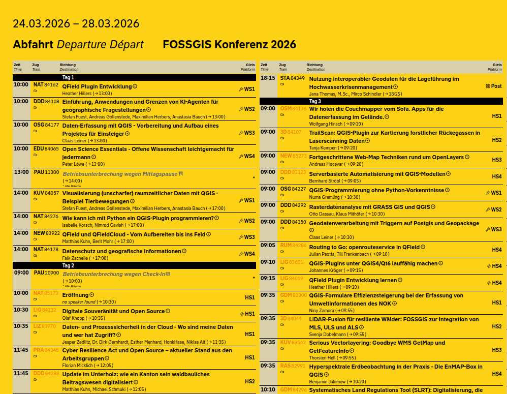

# fossgis-fahrplan-druck

Fork von [c3-fahrplan-druck](https://github.com/felixdivo/c3-fahrplan-druck) für die FOSSGIS-Konferenz.

The [Fahrplan](https://fahrplan.events.ccc.de/congress/2025/fahrplan) in the style of a [Fahrplan](https://upload.wikimedia.org/wikipedia/commons/e/ed/Bremen%2C_Fahrplan_(Hbf).jpg).

## Anpassung für FOSSGIS

Dieses Repository ist ein Fork für die FOSSGIS-Konferenz. Geplant ist, Änderungen von [c3-fahrplan-druck](https://github.com/felixdivo/c3-fahrplan-druck) (Upstream) mitzuziehen, damit Verbesserungen und Fixes dort auch hier ankommen.

**FOSSGIS-spezifisch angepasst wurden u. a.:**

- **Events:** `events/fossgis2026/` (und ggf. weitere FOSSGIS-Jahrgänge) mit Pretalx-Feed, FOSSGIS-Tracks und -Räumen; Pausen werden aus dem Pretalx-Widget übernommen und angezeigt.
- **Branding:** FOSSGIS-Logo (farbig), FOSSGIS-Farben (Akzent HKS 6 K, Hintergrund für getönte Ansicht), Legendentext.
- **Struktur:** CCC-spezifische Styles/Referenzen (z. B. 39c3-Logo, Kario-Font) in den FOSSGIS-Events entfernt oder durch FOSSGIS-Varianten ersetzt. 
- **only-track:** Die Sonderwerte `fahrplan` (Hauptbühne) und `abfahrplan` (Musik-Floors) existieren bei FOSSGIS nicht und werden ignoriert; `only-track` filtert nur nach Track-Namen bzw. -Kürzeln.
- **Customization:** Neben den gleichen Top-Level-Konstanten wie im Upstream nutzen die FOSSGIS-Events zusätzlich z. B. `breakRoomName`, `breakPrefix`, `breakTitlePrefix`, `redRoomsList`; Raumnamen und Kürzel stehen in der Funktion `abbreviateRoom()`.
- **Video-Links:** `streamingUrlByRoom` bildet Raum-Kürzel (wie in `abbreviateRoom`) auf die Livestream-URL (streaming.media.ccc.de) pro Raum ab. Leerer String `''` = kein Stream für diesen Raum. Am Konferenztag wird der Livestream-Link angezeigt, an vergangenen Tagen der Aufzeichnungs-Link (media.ccc.de/v/{slug}), an zukünftigen Tagen nur das Video-Icon ohne Link; `do_not_record` wird weiterhin beachtet.
- **QR-Codes:** Das Skript `scripts/generate_qr_code.py` erzeugt QR-Codes mit runden Modulen, optionalem Logo und Beschriftung für Links (z. B. Fahrplan-URL, Pretalx, Mastodon); siehe `assets/README.md`.
- **Filter-Links (FOSSGIS 2026):** Die URL-Parameter `only-track`, `only-room` und `only-day` lassen sich per Klick setzen und kombinieren. In der Legende sind die Track-Kürzel („Events im Hauptverkehr“) und die Raumliste („Räume / Rooms“) als Links umgesetzt: Ein Klick aktiviert den jeweiligen Filter (bestehende Parameter bleiben erhalten), ein zweiter Klick auf denselben Eintrag entfernt nur diesen Parameter (Toggle). Die Tageszeilen „Tag 1“, „Tag 2“ usw. in der Mehr-Tage-Ansicht sind ebenfalls Links zum Setzen von `only-day`. Ein zentraler **Reset** ist über den Seitentitel („FOSSGIS Konferenz 2026“) möglich: Ein Klick lädt die Seite ohne Query-Parameter und hebt alle Filter auf.
- Link-Unterstreichungen werden im Print per `no-link-underline=1` entfernt, Workaround für den Druck.

## Quick use

1) Open `index.html` in a browser (no build steps needed).
2) Append URL parameters to filter the rendered plan:
   - `only-day=<n>`: Render a single conference day (e.g., `only-day=1`). Days use the indices from the JSON feed (see below; currently 0–4). Omit to show all days in one sheet. This also switches from per-day headers to time-band grouping.
   - `only-track=<nameOrCode>`: Filter by track. Accepts full track names or the short codes from the track map (see table). Examples: `only-track=Science`, `only-track=SCI`.
     Special modes as homage to their original meanings: `only-track=fahrplan` (main stage content only) and `only-track=abfahrplan` (music floors only), which override the `only-room` setting. 
   - `only-room=<room>`: Filter by room, case-insensitively (e.g., `only-room=Stonewall IO`). Abbreviations are intentionally not supported, but substrings work (e.g., `only-room=Stonewall`).
   - `tinted-background=false`: Disable the default yellow-tinted background color.
   - `columns=<n>`: Set the number of columns (e.g., `columns=1` for a single-column layout). The page width scales proportionally from the 8-column default.
     The special mode `columns=mobile` enables a single-column view that uses the full device width.
3) Parameters can be combined, e.g., `?only-day=2&only-track=SCI`.

## Printing

We had some issues printing this to PDF if the size grows beyond DIN A0+. However, directly using the system (not the browser-provided) printing dialog and saving that as PDF or directly printing from that worked for us.

We strongly recommend directly using yellow paper (RAL 1003 Signalgelb/Signal Yellow) for physical prints (and setting `tinted-background=false`).

## Contributing new events

Feel free to fork this and use it on your event!

We plan to collect and archive Fahrpläne for various events. ❤️
If you create one for your event, please consider sharing it back with us so we can add it to the collection!
It should be as easy as forking this repo, adding a unique folder under `events/` (possibly copying content from an existing event), and creating a pull request.

### Customization

Top-level constants near the start of each event's `index.html` control basic event-specific behavior:
- `scheduleUrl`: JSON feed to load (currently the 39C3 schedule).
- `trackMap`: Map track names from the feed to short codes shown in the table.
- `totalDays`: Number of conference days used for day labels and footer copy.
- `headerDateRange`: Text shown in the top-left header.
- `stationName`: Main title in the header area (also used when showing active filters).
- `timeRanges`: Time-band labels for single-day grouping.
- `roomAbbrevMap`: Exact room name to abbreviation/icon mapping.
- `mainStageRoomAbbrevs`: Abbreviation list for main stage highlighting and `only-track=fahrplan` filtering.
- `musicRoomNames`: Room name list used for `only-track=abfahrplan` filtering.
- `roomAbbrevPartial`: Partial room name matches to abbreviation/icon mapping.

For deeper layout or style tweaks, edit `index.html` and `style.css` directly.
If anything feels unclear, feel free to reach out (e.g., open an [issue](https://github.com/felixdivo/c3-fahrplan-druck/issues))!

## Sister Projects

*You are invited to add yours.*

### *[tifa365/c3-abfahrtsmonitor](https://github.com/tifa365/c3-abfahrtsmonitor)* ([Live demo](https://tifa365.github.io/c3-abfahrtsmonitor/))

A live departure-board-style monitor for congress talks, showing delays, scrolling titles, and a news ticker. Great for displaying on screens during the event.

### *[ccoors/typst-fahrplan](https://github.com/ccoors/typst-fahrplan)*

A Typst-based Fahrplan generator, rendering the schedule as a clean vector graphic (SVG/PDF). 
Easy to configure.
